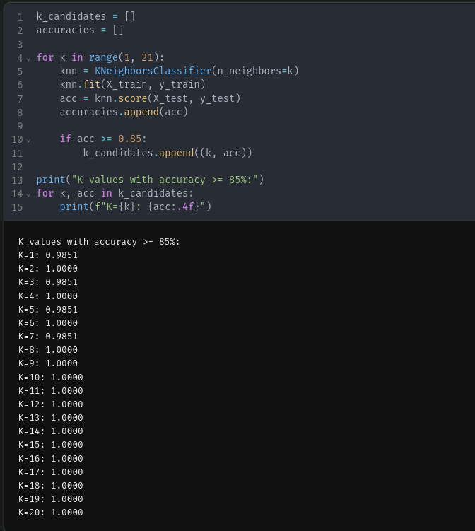
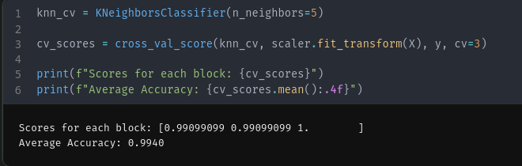
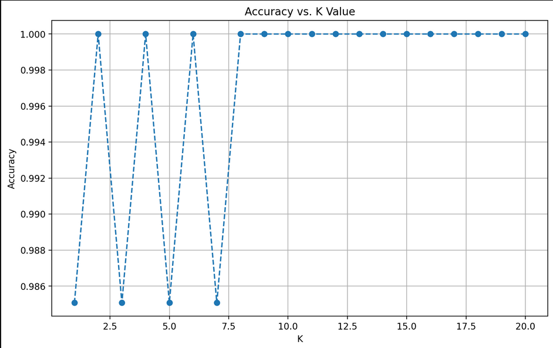

## Запуск

Цей проект використовує пакетний менеджер **[uv](https://docs.astral.sh/uv/)**.

Для налаштування оточення та запуску виконайте:

```bash
uv sync
uv run marimo edit main_nb.py
```

# Лабораторна робота: Класифікація методом K-найближчих сусідів (KNN)

**Мета:** Навчити модель розрізняти три види пінгвінів (Adelie, Chinstrap, Gentoo) за їхніми фізичними вимірами, досягнувши точності понад 85%.

## 1. Підготовка даних

* **Датасет:** Palmer Penguins (`penguins_size.csv`). Це реальні дані про розміри дзьоба, крил та масу тіла пінгвінів.
* **Чистка:** Викинули рядки з пустими значеннями (NaN) та одного пінгвіна з помилковою статтю `.` (одруківка в датасеті).
* **Обробка:**
  * Текстові колонки (`island`, `sex`) перегнали в цифри через `get_dummies`.
  * **Важливо:** Зробили **StandardScaling** (Z-score). Це критично для KNN, бо маса тіла (4000 г) значно більша за розмір дзьоба (40 мм). Без скейлінгу алгоритм звертав би увагу лише на вагу.
* **Розподіл:** 80% на навчання, 20% на тест.

## 2. Пошук параметрів (K)

Ми написали цикл, щоб перевірити кількість сусідів від 1 до 20.
Як видно на скріншоті нижче, **всі** варіанти дають точність вище необхідних 85%.



*(Тут видно, що при парних K точність досягає 100%, а при непарних — 98.5%)*

## 3. Результати та Валідація

* **Точність (Accuracy):** Скаче між **98.5%** та **100%**.
  * *Пояснення:* Датасет дуже чистий, види пінгвінів геометрично далекі один від одного.
  * Графік показує "пилку": на непарних $K$ (1, 3, 5) точність 98.5% (модель помиляється на одній складній "спірній" точці), а на парних $K$ ця точка перекривається голосами більшості.

* **Крос-валідація (3 блоки):**
  Щоб переконатися, що 100% це не просто везіння, ми запустили крос-валідацію.
  Середня точність вийшла **99.4%**.



*(Результат виконання крос-валідації)*

## 4. Візуалізація



На графіку наочно видно цю "пилку". Пунктирна лінія показує, як точність залежить від парності/непарності "суддів" (сусідів).
